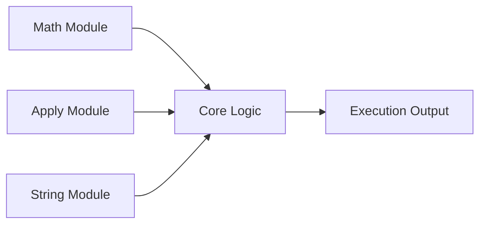

<h1 align="center">⚡ R Programming Examples</h1>

<p align="center">
  
</p>

<p align="center">
  
</p>

---

## 🧠 ✦ About This Project

<p align="center">
A **modern, structured R learning repository** designed to help you master  
<strong>core programming concepts</strong> through practical examples.
</p>

---

## ⚡ ✦ Interactive Modules

<p align="center">


</p>

---

## 🗂️ ✦ System Architecture


---
## 🚀 ✦ Quick Launch
<div align="center">
```bash
git clone https://github.com/YOUR_USERNAME/r-programming-examples.git

cd r-programming-examples

Rscript math/01_basic_math.R
</div>
---

##📊 ✦ Feature Dashboard
```bash
## Feature	Status
📊 Math Functions	✅
⚙️ Apply Family	✅
🔤 String Ops	✅
📚 Documentation	✅
```
</p>
---

##🧩 ✦ Code Engines

🔢 Math Engine
```
min(), max(), sum(), mean()
sqrt(), abs(), round()
sin(), cos(), exp(), sd()
```
⚙️ Apply Engine
```
apply()   lapply()   sapply()
mapply()  tapply()   vapply()
```
🔤 String Engine
```
nchar()  paste()
toupper()  tolower()
grep()  substr()  strsplit()
```
📈 ✦ Learning Progress
<p align="center">     </p>

🧠 ✦ Learning Path
Start → Basics → Practice → Apply → Build → Mastery 🚀
